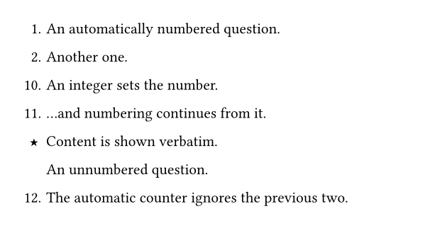
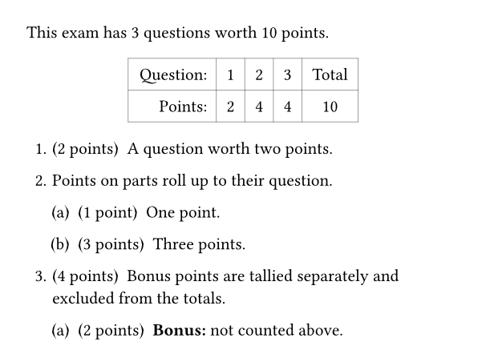
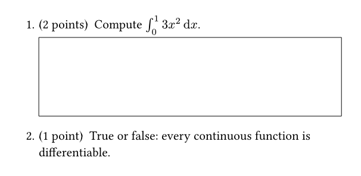
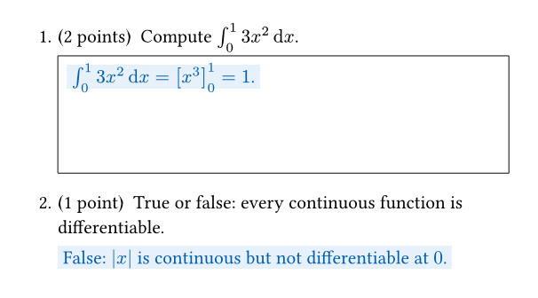
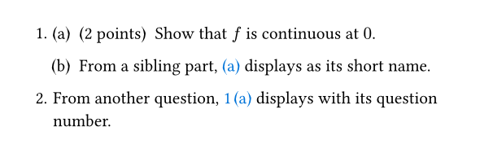
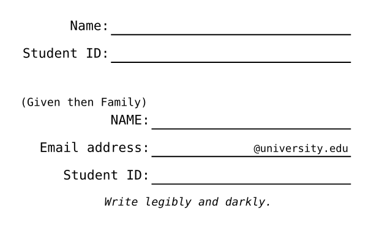

# examy

A [Typst](https://typst.app) package for writing exams, quizzes, and homework
with automatically numbered questions, answer boxes, points accounting, smart
cross-references, and solutions that can be toggled on and off. This package
follows the spirit of the [exam class for LaTeX](https://ctan.org/pkg/exam?lang=en).

<p align="center">
  
  
</p>
<p align="center"><em><a href="examples/quiz.typ">examples/quiz.typ</a>, compiled without and with solutions.</em></p>

## Quick start

```typst
#import "@preview/examy:0.2.0": *

#show: e.prepare()
#show: e.set_(config, show-solutions: false)

// A fill-in block (Name / Student ID) at the top of the page
#name-block()

#exam(
  questions: [
    #question(points: 2)[
      State the definition of a _continuous function_.
      #answer-box(width: 100%, height: 1fr)[
        #solution[A function $f$ is continuous at $a$ if ...]
      ]
    ]
    #question(points: 3)[
      Give an example of a continuous function that is not differentiable.
      #answer-box(width: 100%, height: 2fr)[
        #solution[$f(x) = |x|$ ...]
      ]
    ]
  ],
)
```

The two `#show` lines are required: `e.prepare()` enables
[elembic](https://typst.app/universe/package/elembic) elements and references,
and `e.set_(config, ...)` sets package options.

## Features

### Questions, parts, and subparts

A document is built out of an `#exam(..., questions: [...])`. Inside of `questions`, the commands
`#question[...]`, `#part[...]`, and `#subpart[...]` can be used to create a question hierarchy. 
Questions/parts/subparts can be assigned points, heights, etc.

From [examples/final-exam.typ](examples/final-exam.typ) (solutions
abridged), rendered below it:

```typst
#question[
  Let $f(x) = x^2 sin(1/x)$ for $x != 0$ and let $f(0) = 0$.
  #part(points: 2, label: <continuity>)[
    Show that $f$ is continuous at $x = 0$.
    #answer-box(width: 100%, height: 1fr)[
      #solution[...]
    ]
  ]
  #part(points: 3)[
    Is $f$ differentiable at $x = 0$? Justify your answer. (You may use
    your result from @continuity.)
    #answer-box(width: 100%, height: 1fr)[
      #solution[...]
    ]
  ]
]
```

<p align="center">
  
</p>

Numbering can be customized per division with the `number:` argument:
`auto` (default), an integer to set the number (later divisions continue
from it), arbitrary content (e.g. `number: "★"`) shown verbatim, or `none`
for an unnumbered division. From
[examples/numbering.typ](examples/numbering.typ):

```typst
#question[An automatically numbered question.]
#question[Another one.]
#question(number: 10)[An integer sets the number.]
#question[...and numbering continues from it.]
#question(number: "★")[Content is shown verbatim.]
#question(number: none)[An unnumbered question.]
#question[The automatic counter ignores the previous two.]
```

<p align="center">
  
</p>

### Points

Give any question/part/subpart giving a value to `points: x` will cause an "(x points)"
annotation to show next to the question/part/subpart.
Related to points is:

- `#points-table` render a scoring table.
- `#num-points` and `#num-questions` give total number of points and questions.
- `intent: "bonus"` bonus points are tracked separately and excluded from the
  regular totals.

From [examples/points.typ](examples/points.typ):

```typst
This exam has #num-questions questions worth #num-points points.

#{
  set align(center)
  points-table
}

#exam(questions: [
  #question(points: 2)[A question worth two points.]
  #question[
    Points on parts roll up to their question.
    #part(points: 1)[One point.]
    #part(points: 3)[Three points.]
  ]
  #question(points: 4)[
    Bonus points are tallied separately and excluded from the totals.
    #part(points: 2, intent: "bonus")[*Bonus:* not counted above.]
  ]
])
```

<p align="center">
  
</p>

### Answer boxes

`#answer-box(width: ..., height: ...)[...]` draws a box for students to write
in. A fixed height (`2cm`, `1in`, ...) gives a box of that size; a *fraction*
height (`1fr`, `2fr`, ...) makes the box grow to fill the remaining space on
the page — multiple `fr` boxes on one page share the leftover space
proportionally.

### Solutions

Wrap solutions in `#solution[...]` (anywhere in your document, including inside an answer box).
Solutions are only rendered when enabled, so the same source produces
both the exam and the answer key:

```bash
typst compile exam.typ                                 # whatever the document configures
typst compile --input show-solutions=false exam.typ    # student version (force solutions off)
typst compile --input show-solutions=true exam.typ     # answer key (force solutions on)
```

When given on the command line, the `show-solutions` input overrides the document setting
`#show: e.set_(config, show-solutions: ...)`. This can be used in
build scripts that must produce a specific variant regardless of what the
source file currently configures.

Both renders of [examples/solutions.typ](examples/solutions.typ), which puts
one solution inside an answer box and one inline:

<p align="center">
  
  
</p>

Alternatively, Typst's (experimental) *bundle* export can emit both PDFs
from a single compilation: wrap the exam in a function of the
`show-solutions` value and construct one `document` per variant. From
[examples/bundle.typ](examples/bundle.typ):

```typst
#let quiz(solutions) = {
  set page(paper: "us-letter", margin: 1in)
  show: e.prepare()
  show: e.set_(config, show-solutions: solutions)

  name-block()
  exam(questions: [
    ...
  ])
}

#document("quiz-nosolutions.pdf", quiz(false))
#document("quiz-solutions.pdf", quiz(true))
```

```bash
typst compile --features bundle -f bundle bundle.typ out/
# writes out/quiz-nosolutions.pdf and out/quiz-solutions.pdf
```

Solutions are wrapped in `context {...}`, which limits their use in some cases. You can manually access the
`show-solutions` config variable in these cases via elembic methods.

```typst
#e.get(get => {
  // `get(config).show-solutions` would read the raw config value; the
  // `show-solutions` helper also honors the command-line override.
  let solutions = show-solutions(get) != false
  let xs = lq.linspace(-2 * calc.pi, 2 * calc.pi, num: 200)
  lq.diagram(
    width: 12cm,
    height: 5.5cm,
    xlabel: $x$,
    ylabel: $y$,
    lq.plot(xs, xs.map(x => calc.sin(x)), mark: none, color: black, label: $f$),
    ..if solutions {
      (lq.plot(xs, xs.map(x => calc.cos(x)), mark: none, color: blue, stroke: 2pt),)
    } else { () },
  )
})
```

[examples/quiz.typ](examples/quiz.typ) uses this to add the answer curve of
a sketch-the-derivative question (drawn with
[lilaq](https://typst.app/universe/package/lilaq)) only on the answer key —
visible in the screenshot pair at the top of this page.

### Cross-references

Label a division with `label: <name>` and reference it with `@name`. The
displayed text adapts to where the reference appears: referencing question 1
part (a) shows "1 (a)" from inside question 2, but just "(a)" from elsewhere
in question 1. From
[examples/cross-references.typ](examples/cross-references.typ):

```typst
#question[
  #part(points: 2, label: <continuity>)[Show that $f$ is continuous at $0$.]
  #part[From a sibling part, @continuity displays as its short name.]
]
#question[From another question, @continuity displays with its question number.]
```

<p align="center">
  
</p>

### Page breaks inside questions

`#pagebreak()` works inside questions, parts, and subparts: the division
continues on the next page at the correct indentation, without repeating its
number.

### Name blocks

`#name-block()` renders a fill-in block (Name / Student ID by default). It
is ordinary content: put it at the top of a quiz page, on a cover page, or
anywhere else. The rows are configurable with
`fields:` — an entry is either a `(prefix: ..., suffix: ...)` dictionary,
rendered as the prefix, an underline extending to the end of the line, and
the suffix sitting on the line at its right end, or arbitrary content shown
verbatim as its own row. An optional `title:` is shown above the block.
From [examples/name-blocks.typ](examples/name-blocks.typ):

```typst
// The default block: a Name row and a Student ID row.
#name-block()

// Custom rows.
#name-block(fields: (
  (prefix: [#text(size: .85em)[(Given then Family)] \ NAME:]),
  (prefix: [Email address:], suffix: [`@university.edu`]),
  (prefix: [Student ID:]),
  {
    set align(center)
    text(size: .85em)[_Write legibly and darkly._]
  },
))
```

<p align="center">
  
</p>

Institution-specific layouts ship with the package as `presets`; the
University of Toronto block is `#name-block(fields:
presets.utoronto.name_fields)`.

### Exam cover page

A cover page is ordinary content before `#exam(...)`. Set the exam's
details (`institution`, `exam-name`, `term`, `duration`) on the `config`
object and render them with `#maketitle()`; compose the rest — name blocks,
instructions, a points table — around it in whatever order suits your
institution, and end the page with `#pagebreak()`. Each configured value can
be overridden per call, e.g. `#maketitle(term: [Summer 2026])`:

From [examples/final-exam.typ](examples/final-exam.typ) (name fields
abridged), rendered below:

```typst
#show: e.set_(
  config,
  institution: [University of Examples],
  exam-name: [MAT 101 Final Exam],
  term: [Winter 2026],
  duration: duration(minutes: 150),
)

#maketitle()
#name-block(fields: (
  (prefix: [#text(size: .85em)[(Given then Family)] \ NAME:]),
  ..
))

#underline[_Instructions:_]
- Fill out your name and student information at the top of this page.
- Answer each question in the box provided; work outside the boxes will
  not be graded.
- The back of each page may be used for scratch work.
- No calculators or other aids are permitted.

#v(1fr)
#{
  set align(center)
  points-table
}
#pagebreak()

#exam(questions: [...])
```

See [examples/quiz.typ](examples/quiz.typ) for a minimal quiz,
[examples/final-exam.typ](examples/final-exam.typ) for a complete exam with
custom name fields, and
[examples/utoronto-exam.typ](examples/utoronto-exam.typ) for the preset in
use.

<p align="center">
  
</p>

## Development

Requires Typst 0.15 (a [dev container](.devcontainer) with the right
toolchain and fonts is included).

The package works by flattening nested questions into a stream of `metadata`
markers, then re-parsing that stream: tokenize → parse → plan → render. This
is what makes page breaks and `1fr` heights work inside (conceptually) nested
blocks, which Typst cannot break natively. The architecture, data structures,
and design decisions are documented in [DESIGN.md](DESIGN.md).

```bash
# run the test suite (asserts + a full-pipeline integration document)
./tests/run.sh

# regenerate API.md: docs/generate-api.typ introspects the elembic element
# declarations (docs, field types, defaults) and builds the reference as a
# Markdown string in #metadata(..) <api>, which this script extracts with
# `typst eval 'query(<api>)..'` and JSON-decodes
./make_docs.sh

# build the publishable package in dist/examy/<version>/ — the folder to
# copy into typst/packages under packages/preview/. Runs the tests,
# compiles the examples, regenerates the README screenshots, rewrites
# example imports to @preview/examy, and validates the result via
# TYPST_PACKAGE_PATH (CI does the same and compiles a smoke-test document
# against the vendored package).
./make_dist.sh

# compile the examples
typst compile --root . -f pdf examples/final-exam.typ final-exam.pdf

# regenerate the README screenshots; student-version images force
# --input show-solutions=false so they stay solution-free regardless of the
# example file's own config
typst compile --root . -f png --ppi 110 --pages 1 --input show-solutions=false examples/final-exam.typ examples/images/cover.png
typst compile --root . -f png --ppi 110 --pages 3 --input show-solutions=false examples/final-exam.typ examples/images/question-page.png
typst compile --root . -f png --ppi 110 --input show-solutions=false examples/quiz.typ examples/images/quiz.png
typst compile --root . -f png --ppi 110 --input show-solutions=true examples/quiz.typ examples/images/quiz-solutions.png
typst compile --root . -f png --ppi 140 examples/numbering.typ examples/images/numbering.png
typst compile --root . -f png --ppi 140 examples/points.typ examples/images/points.png
typst compile --root . -f png --ppi 140 --input show-solutions=false examples/solutions.typ examples/images/solutions.png
typst compile --root . -f png --ppi 140 --input show-solutions=true examples/solutions.typ examples/images/solutions-key.png
typst compile --root . -f png --ppi 140 examples/cross-references.typ examples/images/cross-references.png
typst compile --root . -f png --ppi 140 examples/name-blocks.typ examples/images/name-blocks.png
```

### Making a release

1. Bump `version` in `typst.toml` — the elembic prefix, the example
   imports, and the dist layout all derive from it.
2. Run `./make_dist.sh`. If the tests and validation pass, it produces
   `dist/examy/<version>/` containing the package exactly as it should be
   published (example imports rewritten to `@preview/examy:<version>`, this
   Development section stripped from the README).
3. Copy `dist/examy/<version>` into a fork of
   [typst/packages](https://github.com/typst/packages) as
   `packages/preview/examy/<version>` and open a pull request.

Source layout (`src/`): `divisions.typ` (public constructors),
`markers.typ`/`scan.typ`/`tokenize.typ`/`parse.typ`/`plan.typ`/`render.typ`
(the pipeline), `refs.typ` (smart references), `points.typ` (totals and the
scoring table), and `elements/` (the exam cover, answer boxes, solutions,
config).

## License

MIT OR Apache-2.0
