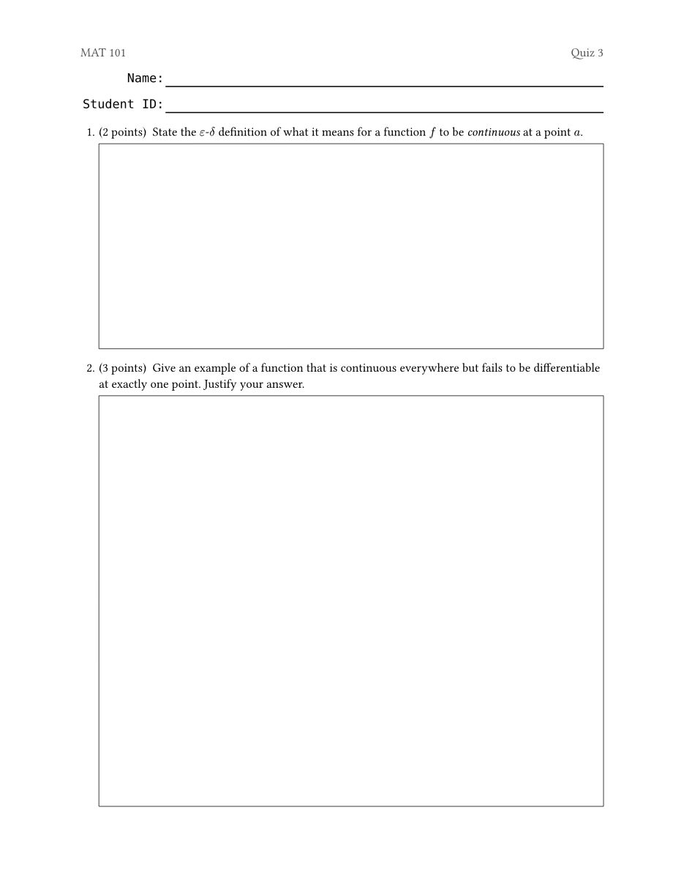
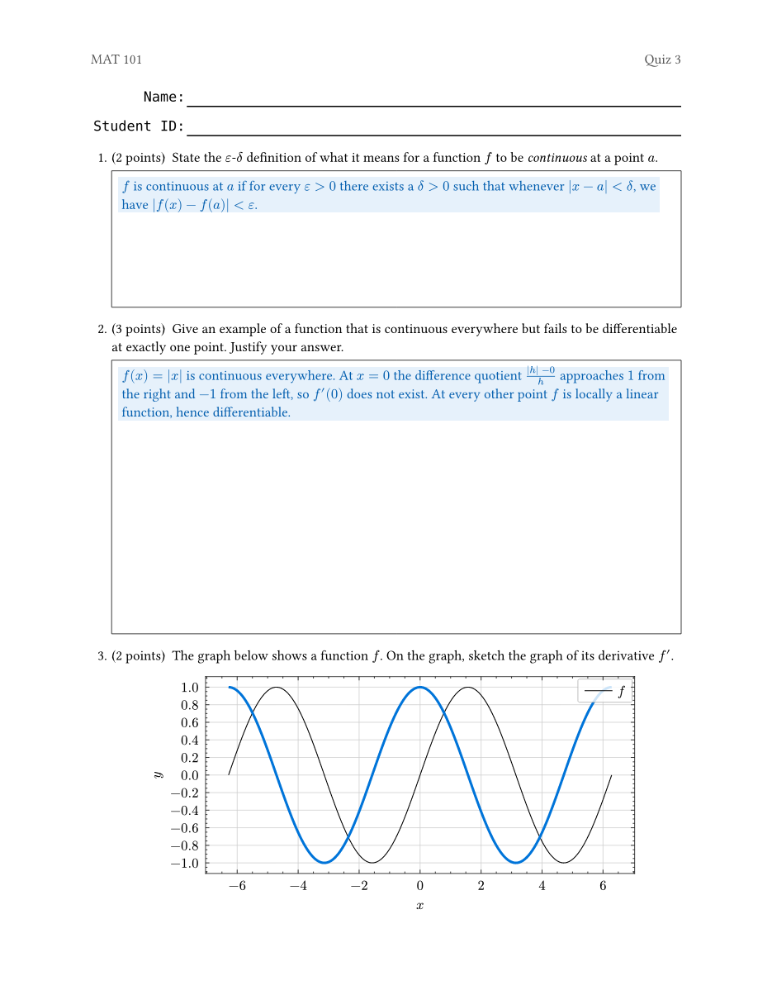
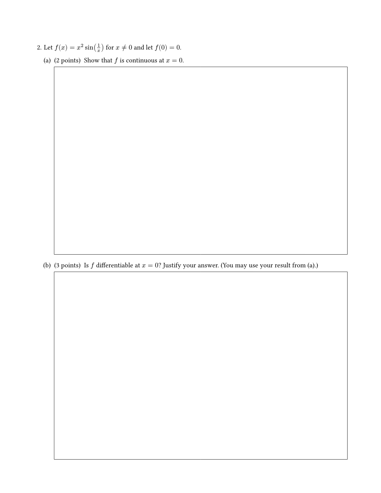
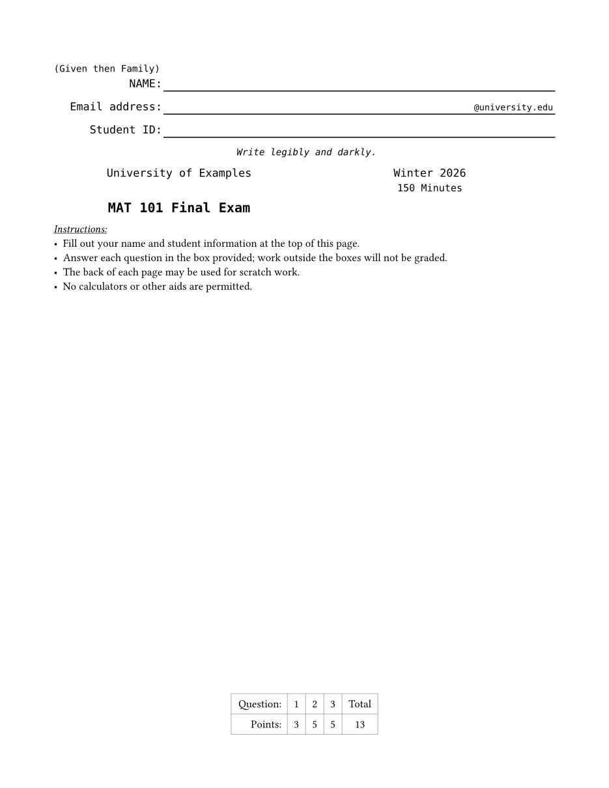

# examy

A [Typst](https://typst.app) package for writing exams, quizzes, and homework
with automatically numbered questions, answer boxes, points accounting, smart
cross-references, and solutions that can be toggled on and off.

<p align="center">
  
  
</p>
<p align="center"><em>The same source, compiled without and with solutions.</em></p>

## Quick start

```typst
#import "@preview/examy:0.2.0": *

#show: e.prepare()
#show: e.set_(config, show-solutions: false)

#exam(
  name_list: (none,), // one name/ID block at the top of the page
  questions: [
    #question(points: 2)[
      State the definition of a _continuous function_.
      #answer-box(width: 100%, height: 1fr)[
        #solution[A function $f$ is continuous at $a$ if ...]
      ]
    ]
    #question(points: 3)[
      Give an example of a continuous function that is not differentiable.
      #answer-box(width: 100%, height: 2fr)[
        #solution[$f(x) = |x|$ ...]
      ]
    ]
  ],
)
```

The two `#show` lines are required: `e.prepare()` enables
[elembic](https://typst.app/universe/package/elembic) elements and references,
and `e.set_(config, ...)` sets package options.

## Features

### Questions, parts, and subparts

`question[...]`, `part[...]`, and `subpart[...]` nest to three levels and are
numbered `1.`, `(a)`, `i.` automatically. The nesting depth (not the
constructor name) determines the numbering style.

```typst
#question[
  Let $f(x) = x^2 sin(1/x)$.
  #part(points: 2)[Show that $f$ is continuous at $0$.]
  #part(points: 3)[Is $f$ differentiable at $0$?]
]
```

Numbering can be customized per division with the `number:` argument:
`auto` (default), an integer to jump the counter, arbitrary content (e.g.
`number: "★"`) shown verbatim, or `none` for an unnumbered division.

<p align="center">
  
</p>

### Points

Give any question, part, or subpart a `points:` value and a "(2 points)"
badge is shown next to it. Points roll up to their question, and:

- `#points-table` renders a scoring table (one column per question) —
  typically placed on the cover page;
- `#num-points` and `#num-questions` give the totals anywhere in the
  document, even before the exam;
- `intent: "bonus"` points are tracked separately and excluded from the
  regular totals; `intent: "practice"` points are excluded entirely.

### Answer boxes

`#answer-box(width: ..., height: ...)[...]` draws a box for students to write
in. A fixed height (`2cm`, `1in`, ...) gives a box of that size; a *fraction*
height (`1fr`, `2fr`, ...) makes the box grow to fill the remaining space on
the page — multiple `fr` boxes on one page share the leftover space
proportionally.

### Solutions

Wrap solution text in `#solution[...]` (inside an answer box or anywhere
else). Solutions are only rendered when enabled, so the same source produces
both the exam and the answer key:

```bash
typst compile exam.typ                                # student version
typst compile --input show-solutions=true exam.typ    # answer key
```

The command-line input overrides the document setting
`#show: e.set_(config, show-solutions: ...)`.

### Cross-references

Label a division with `label: <name>` and reference it with `@name`. The
displayed text adapts to where the reference appears: referencing question 1
part (a) shows "1 (a)" from inside question 2, but just "(a)" from elsewhere
in question 1.

```typst
#part(points: 2, label: <continuity>)[Show that $f$ is continuous at $0$.]
#part(points: 3)[Is $f$ differentiable? You may use @continuity.]
```

### Page breaks inside questions

`#pagebreak()` works inside questions, parts, and subparts: the division
continues on the next page at the correct indentation, without repeating its
number.

### Exam cover page

Passing `institution`, `exam_name`, `term`, `duration`, and/or
`exam_instructions` to `#exam(...)` produces a cover page; `name_list`
adds name/ID blocks (one per entry; an entry is an optional title shown
above the block).

The rows of each block are configurable per institution with
`name_fields:`. An entry is either a `(prefix: ..., suffix: ...)` dictionary
— rendered as the prefix, an underline extending to the end of the line, and
the suffix sitting on the line at its right end — or arbitrary content shown
verbatim as its own row. The default is a Name row and a Student ID row.

```typst
#exam(
  name_list: (none,),
  name_fields: (
    (prefix: [#text(size: .85em)[(Given then Family)] \ NAME:]),
    (prefix: [Email address:], suffix: `@university.edu`),
    (prefix: [Student ID:]),
    align(center, text(size: .85em)[_Write legibly and darkly._]),
  ),
  ...
)
```

See
[examples/final-exam.typ](examples/final-exam.typ) for a complete exam and
[examples/quiz.typ](examples/quiz.typ) for a minimal quiz.

<p align="center">
  
</p>

## Development

Requires Typst 0.15 (a [dev container](.devcontainer) with the right
toolchain and fonts is included).

The package works by flattening nested questions into a stream of `metadata`
markers, then re-parsing that stream: tokenize → parse → plan → render. This
is what makes page breaks and `1fr` heights work inside (conceptually) nested
blocks, which Typst cannot break natively. The architecture, data structures,
and design decisions are documented in [DESIGN.md](DESIGN.md).

```bash
# run the test suite (asserts + a full-pipeline integration document)
./tests/run.sh

# compile the examples
typst compile --root . -f pdf examples/final-exam.typ final-exam.pdf

# regenerate the README screenshots
typst compile --root . -f png --ppi 110 --pages 1 examples/final-exam.typ examples/images/cover.png
typst compile --root . -f png --ppi 110 --pages 3 examples/final-exam.typ examples/images/question-page.png
typst compile --root . -f png --ppi 110 examples/quiz.typ examples/images/quiz.png
typst compile --root . -f png --ppi 110 --input show-solutions=true examples/quiz.typ examples/images/quiz-solutions.png
```

Source layout (`src/`): `divisions.typ` (public constructors),
`markers.typ`/`scan.typ`/`tokenize.typ`/`parse.typ`/`plan.typ`/`render.typ`
(the pipeline), `refs.typ` (smart references), `points.typ` (totals and the
scoring table), and `elements/` (the exam cover, answer boxes, solutions,
config).

## License

MIT OR Apache-2.0
